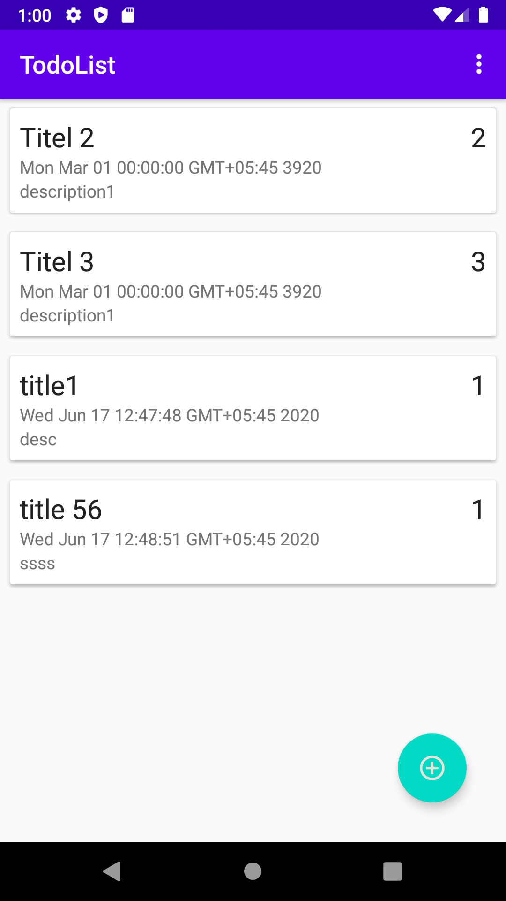

# Key Features of application
- add the tasks by clicking in floating button
- edit the task by clicking on the task
- delete the task by swiping left or right
-function of deleteall task

# Installation guideline
set up android studio (https://developer.android.com/studio)  

clone the project( https://github.com/nilamshrestha1234/TodoApplication.git)

# Plugins and Dependencies
| Dependencies | Implements |
| --- | --- |
| Card View |  implementation "androidx.cardview:cardview:1.0.0" |
| View Model | implementation "androidx.lifecycle:lifecycle-viewmodel:$lifecycle_version"|
|Live Data |  implementation "androidx.lifecycle:lifecycle-livedata:$lifecycle_version" |
|Annonation Processor |  annotationProcessor "androidx.lifecycle:lifecycle-compiler:$lifecycle_version" |
| Room | Database | implementation "androidx.room:room-runtime:$room_version" |
| Life Cycle |  implementation 'androidx.lifecycle:lifecycle-extensions:2.2.0' 

# Steps to follow
- my application
  - mvvm_model
      - Todo.java
      - TodoDao.java
      - TodoDatabase.java
      - DatConversion.java
      - TodoRespository.java
      - TodoViewModel.Java
   - tasks
       - TodoAdapter.java
       - AddEditTodoActivity.java
       - MainActivity.java

# Screenshots of application
| Recycle View| Add Note | Edit Note |
| --- | --- | --- |
|  |  |  |

# Guideline Using the application
- Add Todo: Click on the floating button and add list
- Add Todo Item: Fill the required fields and click on save 
- Edit Todo: Click on the Todo Item and edit the field then save 
- Delete List: Swipe either left or right to delete 1 item and click on delete all to delete all items

# MVVM Architecture Principles
Model-View-ViewModel (MVVM) is a software design pattern that is structured to separate program logic and user interface controls.

The separation of the code in MVVM is divided into View, ViewModel and Model:
- View is the collection of visible elements, which also receives user input. This includes user interfaces (UI), animations and text. The content of View is not interacted with directly to change what is presented.
- ViewModel is located between the View and Model layers. This is where the controls for interacting with View are housed, while binding is used to connect the UI elements in View to the controls in ViewModel.
- Model houses the logic for the program, which is retrieved by the ViewModel upon its own receipt of input from the user through View.

# MVVM Architecture

